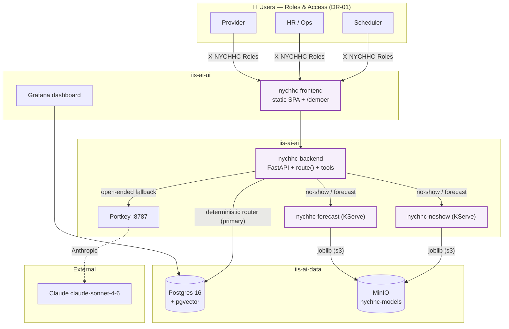

# Architecture — Predictive Hospital Workforce & Patient-Flow (Baremetal)

> ⚠️ **FOR DEMONSTRATION ONLY — NOT FOR CLINICAL USE — SYNTHETIC DATA.**

This is the **baremetal** edition of the NYC Health + Hospitals "Predictive Hospital
Workforce & Patient-Flow" agentic demo. It reproduces the **functionality** of the AWS
version (`company-demos/NYCHHC/`, DR-01…DR-12) but is **re-architected for the on-prem
`ai-demo-stack-baremetal` OpenShift AI platform**, mirroring the deployment conventions of
the sibling `company-demos/amboy/` demo (which already runs on this exact stack).

The demo deploys only its own workloads (every object prefixed `nychhc-`, labeled
`demo: nychhc`) into the platform's **fixed tiered namespaces**; everything else (Postgres,
MinIO, Portkey, Grafana, KServe) is **consumed** by in-cluster service name. The demo never
redeploys or modifies the platform.

## Platform: `ai-demo-stack-baremetal`

- **Cluster:** OCP 4.21, compact 3-node, **CPU-only — NO GPU**. Cluster `ocp419`, domain
  `crucible.iisl.com`. Routes: `https://<route>-<ns>.apps.ocp419.crucible.iisl.com`
  (self-signed wildcard → clients use `-k` / verify-off).
- **Auth:** `export KUBECONFIG=~/GitHub/ai-demo-stack-baremetal/install/_artifacts/auth/kubeconfig`.
  No AWS, no SSO.
- **Fixed tiered namespaces (do NOT invent):**
  - `iis-ai-ai` — gateway/agents + KServe models (backend, predictor, KServe IS live here)
  - `iis-ai-ui` — UIs, Grafana, n8n (frontend lives here)
  - `iis-ai-data` — stateful (Postgres, MinIO)
  - `iis-ai-system` — Vault, Keycloak, MLflow
- **Storage classes:** `ocs-storagecluster-ceph-rbd` (RWO default),
  `ocs-storagecluster-cephfs` (RWX).

## Cloud → baremetal mapping (the core of this port)

| AWS (NYCHHC) | Baremetal (NYCHHC-BareMetal) | Notes |
|---|---|---|
| ROSA/RHOAI `ai-demo` + `*.apps.ai-demo.iisdemolab.click` | OCP `ocp419` + `*.apps.ocp419.crucible.iisl.com` | self-signed wildcard |
| Aurora PostgreSQL (creds in SSM `/ai-demo/aurora/*`) | in-stack **Postgres+pgvector** `iis-ai-postgres-primary.iis-ai-data.svc:5432`, db `rhoai_demo`, user `rhoai_admin`, pw `Demo1234#` (image `pgvector/pgvector:pg16`) | demo owns schemas `workforce`, `rag`, `sched_*` |
| S3 `ai-demo-data-lake` + long-lived IAM user | in-stack **MinIO** `minio.iis-ai-data.svc:9000`, `minioadmin`/`Demo1234#`, bucket `nychhc-models` | KServe model artifacts |
| ECR + Terraform | OpenShift **internal registry** (BuildConfig + ImageStream); **no Terraform/ECR/IAM** | kustomize GitOps + ArgoCD + `deploy.sh`/`destroy.sh` (amboy pattern) |
| GPU A10G + granite-3.1-2b vLLM | **NO GPU** → chat fallback via **Portkey → Claude** (`claude-sonnet-4-6`, OpenAI-compatible at `http://portkey.iis-ai-ai.svc:8787`) | deterministic router stays primary |
| sklearn on KServe (S3 storageUri) | same two sklearn models on **CPU KServe**, custom predictor image (internal registry), `storageUri` → MinIO via `serving.kserve.io/s3-*` annotations | label `iis-ai-ai` `opendatahub.io/dashboard=true` so they show in RHOAI |
| AWS SSO profile `rhoai-demo` | `KUBECONFIG=…/ai-demo-stack-baremetal/install/_artifacts/auth/kubeconfig` | |
| Grafana `rhoai-monitoring` | Grafana in `iis-ai-ui` (provision NYCHHC dashboard via API; remove on destroy) | |
| GPU/worker MachineSet scale-up | **none** (no GPU; fixed 3-node) — all MachineSet scaling dropped | |
| namespace `nychhc-demo` | the four FIXED tiers; resources prefixed `nychhc-`, label `demo: nychhc` | |

## Design decisions (baremetal)

| # | Decision | Choice | Rationale |
|---|----------|--------|-----------|
| D1 | LLM grounding | **Deterministic intent router `route()` primary**; Claude-via-Portkey for open-ended fallback (optional/config-driven) | Router answers the headline asks from real Postgres data — no LLM needed, no flaky small-model tool-calling. Demo works with NO API key (router + rules). |
| D2 | Chat fallback model | **Claude `claude-sonnet-4-6`** via Portkey (`ChatOpenAI` `base_url=http://portkey.iis-ai-ai.svc:8787`), **always `max_tokens`** | Anthropic-via-Portkey 400s without `max_tokens` (amboy lesson). No GPU vLLM on baremetal. |
| D3 | Conversational grounding | **Router + LLM, NO pgvector RAG** *(confirmed)* | Matches what the AWS version actually shipped; fastest/most reliable; no policy-doc corpus to build. |
| D4 | Predictive models (DR-06/08) | **Two CPU sklearn models** (`HistGradientBoostingRegressor`) served on KServe (custom predictor image, joblib pulled from MinIO), **+ graceful rules fallback** | Tiny tabular models; no GPU; fallback keeps the live demo from hard-failing. |
| D5 | PTO/coverage automation (DR-05/07/09) | **In-app impact engine only, NO n8n** *(confirmed)* | `compute_pto_impact` + `apply_reassignments` run in the backend (reassign/reschedule/apply-all-auto), exposed in UI and chat. Self-contained. |
| D6 | Auth / roles (DR-01) | **Dev-mode role header** (`X-NYCHHC-Roles`: Scheduler / HR-Ops / Provider), OIDC-ready but no realm required | Mirrors amboy's `X-Amboy-Roles`. Keycloak has only `master` realm on this stack. |
| D7 | Image strategy | **Single image, multiple roles** (backend + sklearn predictor entrypoints via `NYCHHC_ROLE`); frontend its own static image | amboy pattern; one BuildConfig for the python image, one for the static SPA. |
| D8 | GitOps | **Standalone ArgoCD Application** (`nychhc-demo`), kustomize base, `prune`+`selfHeal`, `resources-finalizer`, `ignoreDifferences` on the KServe image digest | Does NOT edit the platform app-of-apps. |
| D9 | Secrets | **Out-of-band** Secret (`nychhc-creds`) bootstrapped by `deploy.sh` into a synced-path-EXCLUDED location | ArgoCD `selfHeal`/`prune` never blanks it (PD/amboy lesson). |

## Platform services consumed (NOT deployed by this repo)

| Service | Address | Used for |
|---------|---------|----------|
| Postgres + pgvector | `iis-ai-postgres-primary.iis-ai-data.svc:5432` (db `rhoai_demo`, `rhoai_admin`/`Demo1234#`) | Operational SQL (schemas `workforce`, `sched_*`) |
| MinIO (S3) | `minio.iis-ai-data.svc:9000` (`minioadmin`/`Demo1234#`) | KServe model artifacts (bucket `nychhc-models`) |
| Portkey AI Gateway | `http://portkey.iis-ai-ai.svc:8787` (OpenAI-compatible `/v1`) | Open-ended LLM fallback → Claude `claude-sonnet-4-6` |
| KServe | `iis-ai-ai` ns | Serves the two CPU sklearn predictive models |
| Grafana | `iis-ai-ui` ns | Operational dashboard (provisioned via API on deploy) |
| ArgoCD | OpenShift GitOps | Deploys this repo's `gitops/` tree |
| Internal registry | `image-registry.openshift-image-registry.svc:5000` | BuildConfig output (backend + frontend images) |

## Components this demo deploys (prefixed `nychhc-`, labeled `demo: nychhc`)

| Pod / object | Namespace | What it is |
|--------------|-----------|-----------|
| `nychhc-backend` | `iis-ai-ai` | FastAPI + deterministic `route()` + scheduling service + 12 LangChain tools. SSE chat. Every envelope carries the disclaimer. |
| `nychhc-noshow` / `nychhc-forecast` | `iis-ai-ai` | Two KServe `InferenceService`s (custom sklearn predictor image, joblib from MinIO) + stable ClusterIP Services. |
| `nychhc-frontend` | `iis-ai-ui` | Claude-styled static SPA (role panes, scheduling drawer, charts, chat) + `/demoer` presenter console. |
| `nychhc-bootstrap-pgvector` (Job) | `iis-ai-data` | One-shot: create schemas `workforce`/`sched_*`, DDL, load synthetic roster + appointments + PTO. |
| `nychhc-bootstrap-minio` (Job) | `iis-ai-data` | One-shot: create bucket `nychhc-models`, upload the two joblib artifacts. |
| `ServiceAccount` + `Role`/`RoleBinding` | per tier | SCC binding + `patch inferenceservices` for the model-scaler. |
| `Route` + `Service` | per tier | External access to the frontend and backend API. |

## System diagram

*(Purple = built by this repo. Everything else is consumed from the platform.)*

## Hero data flow — "Which cardiologists have openings?" / "Put Dr. Tanaka on PTO 6/16–6/20"

1. User picks a role in the SPA (role drives visible panes + the `X-NYCHHC-Roles` header).
2. Frontend POSTs the question to **`nychhc-backend`** (`/api/chat`, streaming SSE).
3. The **deterministic intent router** (`agent/react.py → route()`) runs **first**. For the
   demo's headline asks it calls the real **scheduling service** against Postgres and returns
   the actual result in plain language:
   - *doctors / openings by specialty* → `scheduling.list_doctors_by_specialty`
   - *no-show rate / risk by provider* → `risk_today` aggregate
   - *unit status / overview* → scalar KPIs
   - *PTO + impact* → `request_pto` + `compute_pto_impact` (reassign/reschedule options)
   - *cancel by patient name* → `find_appointments` + `cancel_appointment` (+ re-offer)
4. Unmatched questions fall through to the LangChain agent on **Claude via Portkey** (output
   cleaned of tool-call/SQL/apology artifacts by `_clean()`); if no API key is configured the
   backend returns a graceful "rephrase" message — the demo never hard-fails.
5. Scheduling writes (book/modify/cancel/PTO/reassign) go straight to Postgres via the
   `sched_*` tables; the in-app impact engine computes coverage gaps and backfill options.
6. Predictive scores (DR-06/08) call the two KServe models; on any error they fall back to
   deterministic rules.
7. **Every** API envelope and UI page carries the disclaimer banner (ASCII variant in HTTP
   headers — the em-dash breaks header encoding).

## Carry-over lessons applied

- **Deterministic router > small-model tool-calling** — `route()` is ported verbatim; it's why chat is reliable.
- **Teardown race** — `destroy.sh` disables ArgoCD automated sync **before** deleting the Application, then deletes labeled resources, then retries (else selfHeal + CreateNamespace re-creates objects).
- **Bootstrap Jobs must be robust** — set `HOME=/tmp` / `MC_CONFIG_DIR` on the `mc` job (arbitrary UID has no HOME) or a hung wave-N Job blocks ALL later sync waves.
- **`oc start-build --wait`** — `--follow` alone does NOT fail the script on a failed build.
- **`max_tokens` on every Portkey/Anthropic request.**
- **Digest-pin** Deployments/IS to the freshly-built digest (`oc get istag nychhc:latest -o jsonpath={.image.metadata.name}`) + `ignoreDifferences` it — internal-registry `:latest` digest caching serves stale images.
- **`oc exec POD -- python - <<EOF` needs `-i`** or stdin isn't forwarded.
- **KServe sometimes drops the model ClusterIP** → own a stable ClusterIP Service selecting the predictor pod (amboy `22-pii-model`).
- **Single-stage UBI python** — the multi-stage `lib`→`lib64` symlink silently drops pip packages.
- **Single-quote `cat <<'EOF'`** for inline YAML with `$vars`; quote paths with `&`.

## Out of scope (carried over from the AWS spec)

HIPAA/security controls · full RBAC · payroll/HRIS write-back · live EHR/FHIR integration ·
live model retraining (the two models are fixed KServe endpoints) · pgvector RAG citations ·
n8n human-in-the-loop. All data is **synthetic**; no PHI, ever (fictional names, phones
`555-01xx`, MRNs `SYN-xxxx`). See [docs/COMPLIANCE.md](docs/COMPLIANCE.md).
