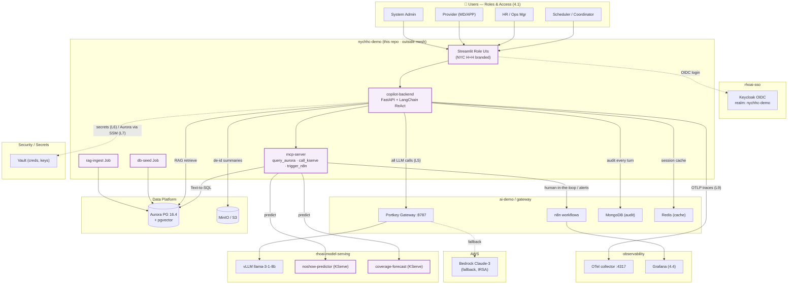

# Architecture — Predictive Hospital Workforce & Patient-Flow

> ⚠️ **FOR DEMONSTRATION ONLY — NOT FOR CLINICAL USE — SYNTHETIC DATA.**

This document shows how the demo's application pods connect to the **existing**
ROSA / OpenShift AI platform. The demo deploys only the components in the
**`nychhc-demo` namespace**; everything else is consumed by service name or
connection string. This mirrors the reference architecture diagram
(`agentic_ai_architecture_aws_hospital_stack.svg`).

## Design decisions (defaults — open to change at review)

| # | Decision | Choice | Rationale |
|---|----------|--------|-----------|
| D1 | Demo namespace | New `nychhc-demo`, **outside** the `data-science-smcp` service mesh | Simpler; no mTLS between demo pods. **Caveat (PD lesson #49/#50):** mesh default is STRICT mTLS, so calling a *mesh* service (`portkey.ai-demo.svc`) from outside can fail post-TLS. Mitigation: call Portkey via its **Route (HTTPS)**, or request PERMISSIVE PeerAuth on Portkey (platform PR), or join the mesh (+`maistra.io/expose-route`, L2). **To verify on first deploy.** |
| D2 | Agent framework | **LangChain** ReAct / function-calling | Matches the reference diagram (not LangGraph). |
| D3 | Tool exposure | A **net-new MCP server** (`+add` in diagram) | Single, auditable tool surface: query Aurora, call KServe, trigger n8n. |
| D4 | LLM routing | **Portkey only** → vLLM Llama-3.1-8B local, Bedrock Claude-3 Haiku fallback | L5. No direct model URLs anywhere. |
| D5 | Predictive models (DR-06/08) | **Real** lightweight models (XGBoost) → MLflow → fixed KServe endpoints, **+ graceful LLM-rules fallback** if endpoint unreachable | Credible to a technical audience; exercises the RHOAI MLOps loop; fallback keeps the live demo from hard-failing. *(Confirmed.)* |
| D6 | Frontend (DR-11) | **Streamlit** role app with an **embedded copilot chat panel**; **Open WebUI** as an alternate entry — both hit the same `copilot-backend` | Keeps the 5-beat demo flow on one screen; still satisfies the diagram/spec's Open WebUI requirement. |
| D7 | Schedule writes | **Human approval required** before any Aurora write | Guardrail from the diagram; agent proposes, human confirms in n8n. |
| D8 | Secrets | **Vault** via init-container / injector annotations | L6. Never in ConfigMaps/images. |
| D9 | Vector store | **Aurora pgvector** (1024-dim, IVFFlat). Milvus is a documented `+add`, not built for the demo. | Keep the demo single-store; diagram marks Milvus optional. |
| D10 | KServe runtime for our models | **CPU sklearn/XGBoost** ServingRuntime (no GPU) | DR-06/08 are tiny tabular models. Avoids the entire PD GPU runbook (g5/A10G, time-slicing, GPU mutex). LLM GPU is the platform's existing Llama. |

### Platform parity — mirrors the police-department demo (same `ai-demo` OCP cluster)

This demo follows the conventions proven by the police-department demo on AWS + OpenShift:

- **Cluster / AWS:** `ai-demo` OCP (API `api.ai-demo.iisdemolab.click`), AWS acct
  `406337554361`, `us-east-1`, SSO profile `rhoai-demo`. *(Verify version — brief says
  4.21, prior notes say 4.20.)*
- **Aurora:** reuse cluster `ai-demo-db`, DB `rhoai_demo`, user `rhoai_admin`; our
  schemas `workforce` + `rag`. Creds bootstrapped from SSM `/ai-demo/aurora/*` into a
  Secret (ArgoCD blanks it → `sync-options=Prune=false` + re-stamp in `01_secrets.sh`).
- **S3:** `s3://ai-demo-data-lake/` prefixes `models/nychhc/`, `processed/nychhc/`,
  served by a **long-lived IAM user** `nychhc-demo-s3-rw` (not 1h STS — PD lesson).
- **GitOps:** ArgoCD apps pin `targetRevision: feature/nychhc-v1`; `selfHeal=false` on
  the inference app.
- **Scripts:** numbered `01_secrets.sh … 05_smoke.sh … 99_teardown.sh`; teardown honors
  a `scaled-up-by` annotation guard on any MachineSet we touch.
- **Docs:** canonical `docs/STATUS.md` (every cluster mutation + rollback) and
  `docs/TROUBLESHOOTING.md`, plus this file's lessons.

## Platform services consumed (NOT deployed by this repo)

| Service | Address / source | Used for |
|---------|------------------|----------|
| Portkey AI Gateway | `http://portkey.ai-demo.svc:8787` | **All** LLM calls (L5) |
| vLLM `llama-3-1-8b` | KServe InferenceService, `rhoai-model-serving` ns (via Portkey) | Primary reasoning |
| Amazon Bedrock | via Portkey virtual key (IRSA) | Fallback reasoning + Titan embeddings |
| Aurora PostgreSQL 16.4 + pgvector | SSM `/ai-demo/aurora/endpoint` (L7) | Operational SQL + vector RAG |
| MongoDB | `ai-demo` ns | Conversation / full audit log |
| Redis | `ai-demo` ns | Session + semantic cache |
| MinIO (S3) | `rhoai-minio` ns, AWS SDK + `endpoint_url` (L8) | De-identified session summaries, model artifacts |
| Vault (dev) | `vault` ns | Tool creds, DB creds, Portkey keys (L6) |
| Keycloak | `rhoai-sso` ns — realm `nychhc-demo` | OIDC for the 4 roles (4.1) |
| n8n | `ai-demo` ns | PTO-impact human-in-the-loop, no-show cron, weekly usage email |
| MLflow | `rhoai-mlflow` ns | Model tracking / registry (D5) |
| KServe | `rhoai-model-serving` ns | Serves the two predictive models |
| Grafana / Tempo / Kiali | `observability` ns | Dashboards (4.4) + traces |
| OTel collector | `otel-collector.observability.svc:4317` (L9) | OTLP traces, `service.name=nychhc-workforce-copilot` |
| ArgoCD | OpenShift GitOps | Deploys this repo's `gitops/` tree |

## Components this demo deploys (in `nychhc-demo`)

| Pod / object | What it is |
|--------------|-----------|
| `copilot-backend` | FastAPI + LangChain ReAct agent. Streams responses; every envelope carries the disclaimer (L10). |
| `mcp-server` | MCP tool server: `query_aurora` (Text-to-SQL), `call_kserve` (no-show / forecast), `trigger_n8n`. |
| `copilot-frontend` | Streamlit role UIs (Scheduler, HR-Ops, Provider, Admin), NYC H+H themed, demo banner. |
| `noshow-predictor` / `coverage-forecast` | Two KServe `InferenceService`s (served from artifacts in MinIO/MLflow). |
| `rag-ingest` (Job) | One-shot: scrape public policy docs → embed → upsert pgvector. |
| `db-seed` (Job) | One-shot: load synthetic workforce data into Aurora tables. |
| `ServiceAccount` + `RoleBinding` | SCC binding for non-default UIDs (L1, L4). |
| `Route` + `Service` | External access to the frontend (and backend API). |

## System diagram

*(Purple = built by this repo. Everything else is consumed.)*

## Hero data flow — "Explain coverage risks next week"

1. User logs into the UI (role determines visible tools/panes).
2. Frontend POSTs the question to **`copilot-backend`** (FastAPI, streaming SSE).
3. **As-built:** a **deterministic intent router** (`agent/react.py → route()`) runs first —
   for the demo's headline asks (doctors/openings by specialty, no-show rate by provider, unit
   status, PTO impact, cancel-by-name) it calls the real scheduling service against Aurora and
   returns the actual result in plain language, so answers don't depend on the small model's
   tool-calling. Unmatched questions fall through to the **LangChain ReAct** agent on the
   GPU-served **granite vLLM** (output cleaned of tool-call/SQL/apology artifacts). (L5)
4. Agent calls the **MCP server** tools as needed:
   - `query_aurora` → current schedule, PTO requests, staffing levels (Text-to-SQL).
   - `call_kserve` → **coverage-forecast** (1–2 wk demand) and **no-show** scores.
   - RAG retrieve over **pgvector** → staffing-ratio policy, PTO policy, care pathways.
5. Agent synthesizes a narrated, **cited** recommendation. If it proposes a schedule
   change, it returns it as a **draft requiring human approval** routed through **n8n** (D7).
6. Every turn is logged to **MongoDB** (full audit) and a de-identified summary to **MinIO**.
7. **OTLP traces** stream to the OTel collector; latency/cost land in **Grafana** (4.4).
8. **Every** API envelope and UI page carries the disclaimer banner. (L10)

## Carry-over lessons applied (from the platform build)

- **L1 / L4** — Every demo pod gets a named `ServiceAccount` + `RoleBinding` to the
  right SCC, defined in the same Kustomize set. No `serviceAccountName:` dangling.
- **L2** — `nychhc-demo` stays **outside** the mesh (D1), so the standard `Route`
  works without `maistra.io/expose-route`. If we later join the mesh, add that
  annotation to the frontend/backend pod templates.
- **L3** — We create our own `StorageClass` only if needed; we don't mutate existing ones.
- **L5** — All LLM traffic via Portkey. No hardcoded OpenAI/Anthropic/vLLM URLs.
- **L6** — Secrets from Vault (init-container → tmpfs). None in ConfigMaps/images.
- **L7** — Aurora connection string from SSM `/ai-demo/aurora/endpoint`.
- **L8** — MinIO via AWS SDK with `endpoint_url` override; creds from platform Secret.
- **L9** — OTLP traces from minute 1, `service.name=nychhc-workforce-copilot`.
- **L10** — Disclaimer banner on every page and every API response envelope.

## Platform dependencies to confirm with platform owner (do NOT change here)

These may require a PR against the **platform** repo, not this one:

1. **Bedrock fallback** — needs a Portkey virtual key + IRSA role with `bedrock:InvokeModel`. If not present, the demo runs vLLM-only and we document the fallback as designed-but-not-wired.
2. **Two new KServe `InferenceService`s** in `rhoai-model-serving` (no-show, forecast) — confirm we may create these, or whether they belong in `nychhc-demo`.
3. **Keycloak realm import** — confirm we may create the `nychhc-demo` realm (4 users) on the existing Keycloak.
4. **n8n** — confirm we may import workflows into the existing n8n instance.
5. **Grafana** — confirm dashboard import permissions / target org.

Anything above that the platform can't grant → **STOP and raise a separate PR**.
