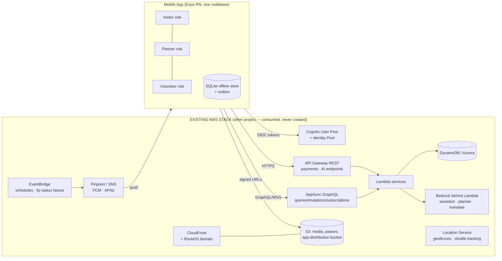

# ARCHITECTURE.md — Bir Festival 2026 App ↔ Existing AWS Stack

Author: Rajeev Jambal (Convenor) · Prepared as the binding architecture for Claude Code.
Rescoped per change order **CO-001**: this is the architecture of the **Bir Festival 2026
app** — one event, **21–23 November 2026**, product life ending **30 November 2026** with
close-out (vendor settlements T+2, volunteer certificates, lost-&-found closure, public
report). Scope: how one React Native codebase serves Visitor, Partner and Volunteer roles
against the **already-deployed AWS stack** (separate project), and how it ships to Play,
App Store and direct-QR channels without ever provisioning backend resources itself.

---

## 1. System context

The app is the festival's mobile client for the three festival days and the close-out
week — nothing more. Every capability below names the contract key it consumes.



**Principle:** the app is a _client of record_, the stack is the _system of record_.

---

## 2. The stack contract (the only coupling point)

The backend project must export these values (CloudFormation Exports / CDK Outputs /
`amplify_outputs.json`). A pipeline step copies them into `config/stack-outputs.json`.
Claude Code validates against `schemas/stack-contract.schema.json` (`npm run contract:check`).

```jsonc
{
  "region": "ap-south-1",
  "auth": {
    "userPoolId": "…",
    "userPoolClientId": "…",
    "identityPoolId": "…",
    "otpChannel": "sms", // Cognito custom auth w/ SNS OTP
  },
  "api": {
    "graphqlEndpoint": "https://….appsync-api…/graphql",
    "graphqlRealtime": "wss://…",
    "restBase": "https://api.bir.example/v1", // API GW custom domain
  },
  "storage": {
    "mediaBucket": "bir-media-…", // read via CloudFront, write via signed URL
    "cdnDomain": "cdn.bir.example",
    "appDistBucket": "bir-app-dist-…", // APK/manifest hosting (see DISTRIBUTION.md)
    "appDistDomain": "get.bir.example",
  },
  "push": { "pinpointAppId": "…", "fcmSenderId": "…" },
  "ai": {
    "assistantPath": "/ai/assistant", // POST {sessionId, text|audio} → SSE stream
    "plannerPath": "/ai/planner",
    "translatePath": "/ai/translate",
    "queuePredictPath": "/ai/queue",
  },
  "payments": { "provider": "razorpay", "orderPath": "/pay/order", "webhookVerified": true },
  "passes": {
    "issuerKid": "bir-2026-01",
    "jwksPath": "/.well-known/bir-passes/jwks.json", // public keys for OFFLINE verification
    "alg": "ES256",
  },
  "realtime": { "alertTopicArnParam": "/bir/sns/emergency" },
  "geo": { "geofenceCollection": "bir-venues", "shuttleTrackerName": "bir-shuttles" },
  "flags": { "festivalMode": true, "experiencesMarketplace": true },
}
```

**`flags.festivalMode`** — backend-controlled contract flag: `true` from launch through
the festival; flipped to `false` at close-out (30 November 2026), which puts the app into
festival-concluded mode — an archival banner, bookings and payments disabled, while
passes, certificates and the public report remain viewable.

All existing keys above are KEPT unchanged (backend naming is out of our control).
Keys newly required by CO-001 are **requested via `docs/BACKEND_ASKS.md` (#8–#13)**, not
added here until the backend exports them: `geo.shuttleEtaPath`,
`ops.flyStatusTopicParam`, `ops.lostFoundPath`, `ops.cleanMetricsPath`,
`ops.reunite.wristbandPath`, `refunds.autoQueueFlag`.

Anything else the app needs beyond this list → write it into `docs/BACKEND_ASKS.md` with
the proposed export name; do not improvise.

---

## 3. Feature → stack mapping (CO-001 baseline: modules A–I + enhancements 1–6)

This table is the authoritative feature list — no extras, no omissions.

| #      | App module                                      | Consumes                                                                                                                                                                 | Notes for Claude Code                                                                                                                                                                                                                                                                                                                                                                                                                                                                                         |
| ------ | ----------------------------------------------- | ------------------------------------------------------------------------------------------------------------------------------------------------------------------------ | ------------------------------------------------------------------------------------------------------------------------------------------------------------------------------------------------------------------------------------------------------------------------------------------------------------------------------------------------------------------------------------------------------------------------------------------------------------------------------------------------------------- |
| A      | Tickets & QR passes                             | `passes.*`, GraphQL `issuePass`, payments REST, S3 pass art                                                                                                              | Purchase → wallet-style pass screen; pass = ES256 JWT rendered as QR; offline-verifiable at gates (§6)                                                                                                                                                                                                                                                                                                                                                                                                        |
| B      | Daily Cultural Nights (every evening 21–23 Nov) | GraphQL schedule/subs + EventBridge fanout via Pinpoint                                                                                                                  | Programme: folk music, traditional dances, live bands, storytelling, comedy & cultural performances, heritage showcases, guest appearances (if applicable), award ceremonies. Visitors: view schedules · reminders · reserve seats (where applicable) · vote for audience favourites — votes power the award ceremonies and queue in the outbox offline                                                                                                                                                       |
| C      | Experience Marketplace (festival week)          | GraphQL + `payments.orderPath` REST                                                                                                                                      | Hotels/homestays/partners host paid experiences: yoga, meditation workshops, wellness, pottery, art workshops, cooking classes, village walks, farm visits, nature & adventure activities. Browse · book · pay · review (verified-booking only). Booking = order (REST) → webhook-confirmed mutation; app polls subscription, never trusts client success. Host payouts on the published T+2 cycle (backend; app shows status)                                                                                |
| D      | Hospitality Partner Programme                   | GraphQL rooms/allocations/check-ins                                                                                                                                      | Tiers: ≤10 rooms → one complimentary twin-sharing room ×2 nights; >10 rooms → two ×2 nights (tier logic backend-side). App: participant allocation · check-in management · occupancy tracking · accommodation coordination; occupancy board renders from cache offline                                                                                                                                                                                                                                        |
| E      | Food Stall Management                           | GraphQL `stallApplication` state machine + analytics feeds                                                                                                               | Applications · approvals · payments · stall allocation · vendor communication · performance analytics (mirror backend Step Functions states read-only). Food-street rules surfaced in-app: single-use-plastic-free, deposit-return cups/plates, daily waste weighed & published                                                                                                                                                                                                                               |
| F      | Volunteer Management (400 volunteers)           | GraphQL rosters + offline scan log + signed-URL uploads                                                                                                                  | Registration · ID verification/upload · team assignments · QR attendance (offline via outbox) · duty rosters · notifications · incident reporting (photo + category, offline-safe) · digital certificates issued within 7 days post-festival                                                                                                                                                                                                                                                                  |
| G      | Organiser Dashboards (14) — organiser-lite      | GraphQL dashboard feeds + `realtime.alertTopicArnParam`                                                                                                                  | Planning & Implementation, Logistics & Infrastructure, Hospitality & Accommodation, Competition Management, Vendor Management, Marketing & Media, Sponsorship, Traffic & Parking, Tourism & Experiences, Volunteer Management, Safety & Medical, Finance, IT & AI Operations, Cleanliness & Sustainability. Each: task management · team communication · live updates · reports · analytics · emergency alerts. Mobile ships the organiser-lite view; the full console remains the web surface                |
| H      | The ten AI features (festival-scoped)           | `ai.assistantPath`, `ai.plannerPath`, `ai.translatePath`, `ai.queuePredictPath` + backend-side services                                                                  | AI Festival Assistant · AI Travel Planner (a visitor's 3-day festival plan) · AI Food Recommendations · AI Translation · AI Queue Prediction · AI Crowd Management · AI Notifications · AI Visitor Analytics · AI Organiser Analytics · AI Marketing Support. ALL via backend endpoints only — the app never calls models directly. Guardrail: **AI suggests, humans decide; the safety officer's "no fly" is final**                                                                                         |
| I      | Community-led collaboration                     | Cognito role groups + CDN-served content                                                                                                                                 | Roles for Local Administration, Taxi Union, Paragliding Pilots Association, Vyapar Mandal, Hotels & Homestays, Self-Help Groups, Mahila Mandals, Youth Clubs, Sponsors, Volunteers, Government Departments; Himachal Tourism invited as official Co-Host. App renders acknowledgements + role-appropriate surfaces; no bespoke backend writes                                                                                                                                                                 |
| E1     | Offline gate scanning                           | `passes.jwksPath` + revocations delta (§6)                                                                                                                               | QR verdict on-device in **<1 s**; a network outage at Chogan must never stop entry, boarding or attendance                                                                                                                                                                                                                                                                                                                                                                                                    |
| E2     | Park-&-shuttle with live tracker                | `geo.shuttleTrackerName` + requested `geo.shuttleEtaPath` (ASK #8)                                                                                                       | Periphery parking; shuttle ETA in-app from the Location tracker; resident/school/patient priority messaging                                                                                                                                                                                                                                                                                                                                                                                                   |
| E3     | Official "Can I fly today?" status              | `realtime.alertTopicArnParam` via Pinpoint + requested `ops.flyStatusTopicParam` (ASK #9), `refunds.autoQueueFlag` (ASK #13)                                             | One weather-hold banner pushed to every device the moment the safety officer calls it; affected flight bookings auto-enter the refund queue **backend-driven** — the app renders state and notifies only                                                                                                                                                                                                                                                                                                      |
| E4     | SOS & medical grid                              | SNS/Pinpoint + `geo.geofenceCollection`                                                                                                                                  | One-tap SOS with location consent; medical posts at Billing, Chogan and the main venue on the map; evacuation-route info screen                                                                                                                                                                                                                                                                                                                                                                               |
| E5     | Deposit-return & cleanliness metrics            | requested `ops.cleanMetricsPath` (ASK #11) + CDN config                                                                                                                  | Visitor-facing return-point map; daily waste figures rendered from the Cleanliness dashboard feed                                                                                                                                                                                                                                                                                                                                                                                                             |
| E6     | Lost & found + child-reunite                    | requested `ops.lostFoundPath` (ASK #10), `ops.reunite.wristbandPath` (ASK #12) + signed-URL photo upload                                                                 | Photo-based lost & found; QR wristband registration/lookup flow for family zones; wristband lookup works offline from cache                                                                                                                                                                                                                                                                                                                                                                                   |
| CO-002 | Highlights & registrations                      | requested `highlights.catalogPath`, `highlights.registerMutation`, `highlights.myRegistrationsQuery`, `highlights.cancelMutation`, `ops.capacityCounters` (ASKs #21–#26) | One generic system for Competitions, Cultural-Night participation, Yoga & Wellness, Pottery & Art, Adventure, Sightseeing: server-driven catalog (organisers edit without app release; cached offline), one shared registration engine (free = outbox-queued offline; paid = webhook-confirmed order per §5, never faked), capacity/waitlist chips. Gate-checked confirmations issue an ES256 QR pass `typ:'activity'` into the SAME offline pass wallet — verifier and revocation sync (§6) reused unchanged |

---

## 4. App architecture (client-side)

```
UI (expo-router screens, role-gated: visitor / partner / volunteer)
        │
Feature modules (src/features/*) — screen logic + hooks only
        │
Domain layer — TanStack Query caches keyed by contract endpoints
        │                         │
AppSync/REST clients        Offline engine (src/offline/)
(Amplify v6, tokens         SQLite tables: passes, scans, schedule,
 from Cognito)              roster, outbox(mutation, retries, idempotencyKey)
        │                         │
        └────── Sync engine: online → drain outbox (FIFO per aggregate),
                subscribe deltas; offline → serve cache, queue writes
```

Role gating: one binary, roles resolved from Cognito groups (`visitor` default,
`partner`, `volunteer`, `organiser-lite`). Partner/volunteer tabs render only when the
group claim is present — no separate apps to maintain during festival week.

---

## 5. Security architecture

- **Tokens:** Cognito OTP (phone-first) → short-lived ID/access tokens; refresh handled by
  Amplify; tokens in secure storage (Keychain/Keystore via `expo-secure-store`).
- **Least privilege:** Identity Pool roles scope S3 to `media/public/*` read and
  `uploads/${identityId}/*` write only.
- **Payments:** order created server-side; app receives only order ID + provider token;
  success is asserted by backend webhook → GraphQL subscription, never by client callback.
- **AI:** all model calls server-side (Bedrock behind Lambda); app sends text/audio,
  receives stream. Prompt-injection surface stays on the backend where it's filtered.
- **Certificate pinning** on `api.*` and `get.*` domains (expo-build-properties + network
  security config / ATS).
- **Tamper channel:** direct-download APK is signed with the SAME upload key as Play;
  the download page publishes SHA-256; app verifies its own signing cert at boot and
  reports channel (`play` / `direct` / `testflight`) in telemetry.

---

## 6. Offline-first pass verification (festival-critical)

Gate scanning must work when the 4G dies at Chogan — this section is the core of
CO-001 enhancement 1 (offline gate scanning, verdict on-device in <1 s) and is unchanged
in design.

1. Backend issues each ticket/roster pass as **ES256 JWT** (`passes.alg`), claims:
   `jti` (pass id), `typ` (ticket | volunteer | volunteer-attendance | seat-entry |
   stall | room | activity — CO-002, ASK #25), `sub`, `evt`, `zones[]`, `nbf/exp`, `seat?`.
2. App bundles NOTHING secret: it caches the **JWKS** from `passes.jwksPath` (refetch
   daily; pin `kid`).
3. Scanner verifies signature + time window **on device**, checks local
   `revocations` table (delta-synced list of revoked `jti`), records scan
   `{jti, gate, ts, deviceId}` into SQLite, displays green/red in <300 ms.
4. Outbox drains scans to GraphQL when connectivity returns; backend reconciles
   duplicates by `(jti, gate)` idempotency.
5. Double-scan defense offline: local unique index on `(jti, gate)`; cross-gate
   duplicates reconciled server-side (acceptable risk, logged).

---

## 7. AWS Well-Architected alignment (mobile perspective)

- **Reliability:** offline cache + outbox; exponential backoff with jitter on all
  clients; subscriptions auto-resume; app functions read-only if auth is degraded.
- **Performance:** Hermes engine; images via CloudFront with `expo-image` caching;
  cold start budget ≤ 2.5 s on a ₹8k Android device (test on Android Go profile).
- **Cost:** subscriptions only for screens on foreground; polling forbidden where a
  subscription exists; media never bundled.
- **Security:** as §5; plus Play Integrity / App Attest attestation tokens attached to
  sensitive mutations when the contract flag enables it.
- **Operational excellence:** Sentry (self-hosted DSN from contract if provided, else
  Pinpoint events only); every release tagged with EAS build ID + git SHA; feature flags
  from contract `flags` so backend can dark-launch.
- **Sustainability:** dark-mode default at festival (OLED savings).

---

## 8. What Claude Code must NOT do

- Create/modify any AWS resource, IAM policy, or Amplify backend.
- Add analytics/ads SDKs, or any dependency phoning home outside the contract domains.
- Store PII in SQLite beyond `{sub, displayName, role, phone-masked}`.
- Bypass the payments webhook-confirmation pattern "to simplify testing".
- Ship English-only strings, or block the main thread during QR verification.
