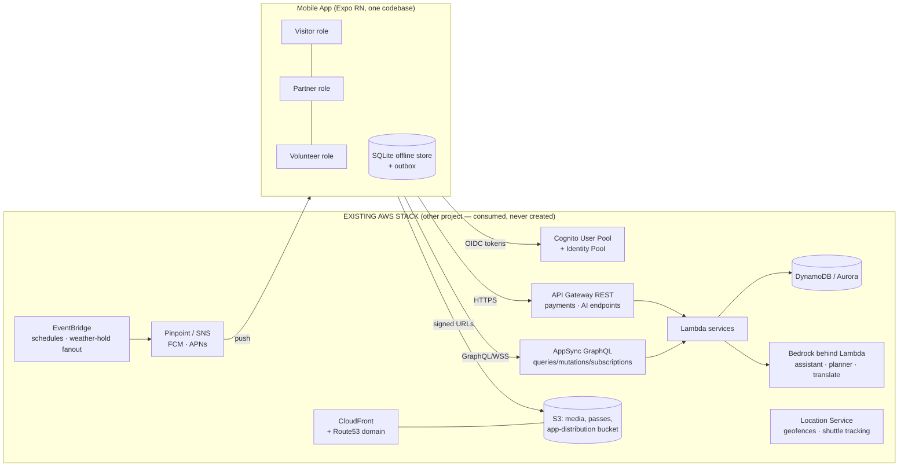

# ARCHITECTURE.md — Bir Mobile ↔ Existing AWS Stack

Author: Rajeev Jambal (Convenor) · Prepared as the binding architecture for Claude Code.
Scope: how one React Native codebase serves Visitor, Partner and Volunteer roles against
the **already-deployed AWS stack** (separate project), and how it ships to Play, App Store
and direct-QR channels without ever provisioning backend resources itself.

---

## 1. System context



**Principle:** the app is a _client of record_, the stack is the _system of record_.
Every capability below names the contract key it consumes.

---

## 2. The stack contract (the only coupling point)

The backend project must export these values (CloudFormation Exports / CDK Outputs /
`amplify_outputs.json`). A pipeline step copies them into `config/stack-outputs.json`.
Claude Code validates against `schemas/stack-contract.schema.json` (`npm run contract:check`).

```jsonc
{
  "region": "ap-south-1",
  "auth": {
    "userPoolId": "…",
    "userPoolClientId": "…",
    "identityPoolId": "…",
    "otpChannel": "sms", // Cognito custom auth w/ SNS OTP
  },
  "api": {
    "graphqlEndpoint": "https://….appsync-api…/graphql",
    "graphqlRealtime": "wss://…",
    "restBase": "https://api.bir.example/v1", // API GW custom domain
  },
  "storage": {
    "mediaBucket": "bir-media-…", // read via CloudFront, write via signed URL
    "cdnDomain": "cdn.bir.example",
    "appDistBucket": "bir-app-dist-…", // APK/manifest hosting (see DISTRIBUTION.md)
    "appDistDomain": "get.bir.example",
  },
  "push": { "pinpointAppId": "…", "fcmSenderId": "…" },
  "ai": {
    "assistantPath": "/ai/assistant", // POST {sessionId, text|audio} → SSE stream
    "plannerPath": "/ai/planner",
    "translatePath": "/ai/translate",
    "queuePredictPath": "/ai/queue",
  },
  "payments": { "provider": "razorpay", "orderPath": "/pay/order", "webhookVerified": true },
  "passes": {
    "issuerKid": "bir-2026-01",
    "jwksPath": "/.well-known/bir-passes/jwks.json", // public keys for OFFLINE verification
    "alg": "ES256",
  },
  "realtime": { "alertTopicArnParam": "/bir/sns/emergency" },
  "geo": { "geofenceCollection": "bir-venues", "shuttleTrackerName": "bir-shuttles" },
  "flags": { "festivalMode": true, "experiencesMarketplace": true },
}
```

Anything the app needs beyond this list → write it into `docs/BACKEND_ASKS.md` with the
proposed export name; do not improvise.

---

## 3. Feature → stack mapping (the 10 AI features + core modules)

| App module                                       | Consumes                                              | Notes for Claude Code                                                                                                               |
| ------------------------------------------------ | ----------------------------------------------------- | ----------------------------------------------------------------------------------------------------------------------------------- |
| Tickets & QR passes                              | `passes.*`, GraphQL `issuePass`, S3 pass art          | Pass = ES256 JWT rendered as QR; verify offline (§6)                                                                                |
| Cultural nights: schedule, reminders, seat votes | GraphQL subs + EventBridge fanout via Pinpoint        | Subscriptions reconnect w/ backoff; votes queue in outbox offline                                                                   |
| Stalls (partner)                                 | GraphQL `stallApplication` state machine              | Mirror backend Step Functions states read-only                                                                                      |
| Hospitality (partner)                            | GraphQL rooms/allocations/check-ins                   | Occupancy board must render from cached data offline                                                                                |
| Experiences marketplace                          | GraphQL + payments REST                               | Booking = create order (REST) → confirm (GraphQL mutation from webhook) — app polls subscription, never trusts client success alone |
| Volunteer corps                                  | GraphQL rosters + offline scan log                    | QR attendance scans stored locally, synced via outbox                                                                               |
| AI Assistant                                     | `ai.assistantPath` (SSE)                              | Streamed tokens; Hindi/English auto by locale; degrade to FAQ cache offline                                                         |
| AI Travel Planner                                | `ai.plannerPath`                                      | Request/response JSON; render itinerary cards; "book all" fans into normal booking flows                                            |
| AI Translate                                     | `ai.translatePath`                                    | Menu/sign photo → text; batch endpoint; cache aggressively                                                                          |
| Queue & crowd                                    | `ai.queuePredictPath` + Location geofences            | Heatmap tiles from CDN, densities from REST; NEVER device-level tracking of other users                                             |
| SOS & emergency alerts                           | SNS topic via Pinpoint push + local full-screen alert | Must fire with app in background; test on both platforms                                                                            |
| Notifications                                    | Pinpoint campaigns/journeys                           | Respect quiet hours & per-user budget server-side; client only registers token + prefs                                              |

---

## 4. App architecture (client-side)

```
UI (expo-router screens, role-gated: visitor / partner / volunteer)
        │
Feature modules (src/features/*) — screen logic + hooks only
        │
Domain layer — TanStack Query caches keyed by contract endpoints
        │                         │
AppSync/REST clients        Offline engine (src/offline/)
(Amplify v6, tokens         SQLite tables: passes, scans, schedule,
 from Cognito)              roster, outbox(mutation, retries, idempotencyKey)
        │                         │
        └────── Sync engine: online → drain outbox (FIFO per aggregate),
                subscribe deltas; offline → serve cache, queue writes
```

Role gating: one binary, roles resolved from Cognito groups (`visitor` default,
`partner`, `volunteer`, `organiser-lite`). Partner/volunteer tabs render only when the
group claim is present — no separate apps to maintain during festival week.

---

## 5. Security architecture

- **Tokens:** Cognito OTP (phone-first) → short-lived ID/access tokens; refresh handled by
  Amplify; tokens in secure storage (Keychain/Keystore via `expo-secure-store`).
- **Least privilege:** Identity Pool roles scope S3 to `media/public/*` read and
  `uploads/${identityId}/*` write only.
- **Payments:** order created server-side; app receives only order ID + provider token;
  success is asserted by backend webhook → GraphQL subscription, never by client callback.
- **AI:** all model calls server-side (Bedrock behind Lambda); app sends text/audio,
  receives stream. Prompt-injection surface stays on the backend where it's filtered.
- **Certificate pinning** on `api.*` and `get.*` domains (expo-build-properties + network
  security config / ATS).
- **Tamper channel:** direct-download APK is signed with the SAME upload key as Play;
  the download page publishes SHA-256; app verifies its own signing cert at boot and
  reports channel (`play` / `direct` / `testflight`) in telemetry.

---

## 6. Offline-first pass verification (festival-critical)

Gate scanning must work when the 4G dies at Chogan.

1. Backend issues each ticket/roster pass as **ES256 JWT** (`passes.alg`), claims:
   `jti` (pass id), `typ` (ticket|volunteer|stall|room), `sub`, `evt`, `zones[]`,
   `nbf/exp`, `seat?`.
2. App bundles NOTHING secret: it caches the **JWKS** from `passes.jwksPath` (refetch
   daily; pin `kid`).
3. Scanner verifies signature + time window **on device**, checks local
   `revocations` table (delta-synced list of revoked `jti`), records scan
   `{jti, gate, ts, deviceId}` into SQLite, displays green/red in <300 ms.
4. Outbox drains scans to GraphQL when connectivity returns; backend reconciles
   duplicates by `(jti, gate)` idempotency.
5. Double-scan defense offline: local unique index on `(jti, gate)`; cross-gate
   duplicates reconciled server-side (acceptable risk, logged).

---

## 7. AWS Well-Architected alignment (mobile perspective)

- **Reliability:** offline cache + outbox; exponential backoff with jitter on all
  clients; subscriptions auto-resume; app functions read-only if auth is degraded.
- **Performance:** Hermes engine; images via CloudFront with `expo-image` caching;
  cold start budget ≤ 2.5 s on a ₹8k Android device (test on Android Go profile).
- **Cost:** subscriptions only for screens on foreground; polling forbidden where a
  subscription exists; media never bundled.
- **Security:** as §5; plus Play Integrity / App Attest attestation tokens attached to
  sensitive mutations when the contract flag enables it.
- **Operational excellence:** Sentry (self-hosted DSN from contract if provided, else
  Pinpoint events only); every release tagged with EAS build ID + git SHA; feature flags
  from contract `flags` so backend can dark-launch.
- **Sustainability:** dark-mode default at festival (OLED savings), batch sync windows.

---

## 8. What Claude Code must NOT do

- Create/modify any AWS resource, IAM policy, or Amplify backend.
- Add analytics/ads SDKs, or any dependency phoning home outside the contract domains.
- Store PII in SQLite beyond `{sub, displayName, role, phone-masked}`.
- Bypass the payments webhook-confirmation pattern "to simplify testing".
- Ship English-only strings, or block the main thread during QR verification.
